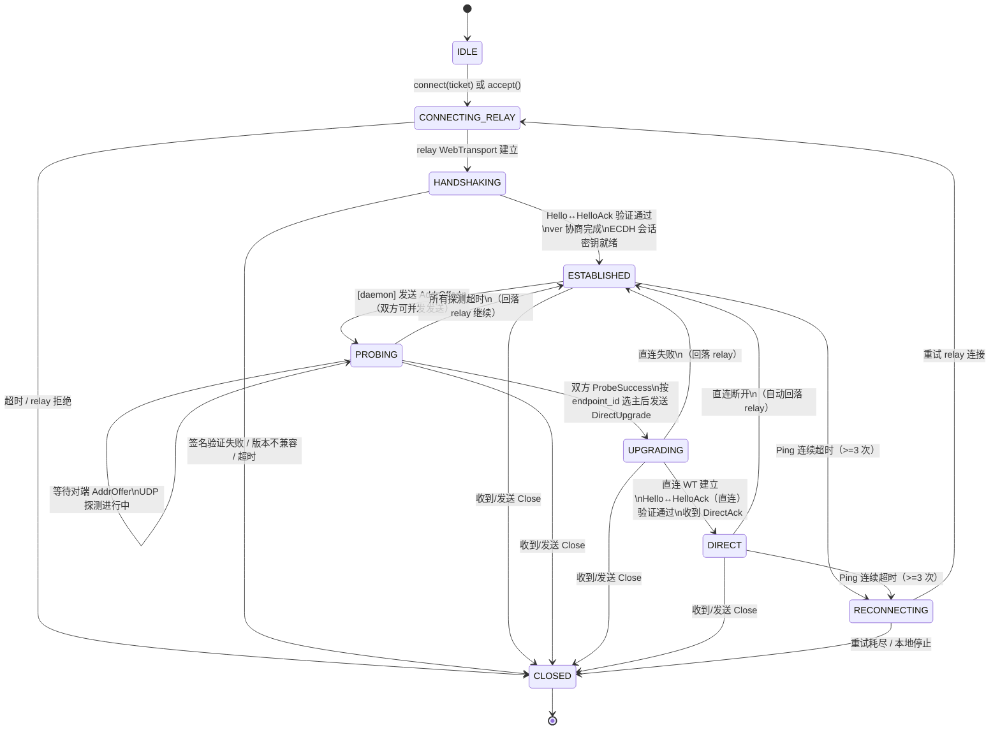
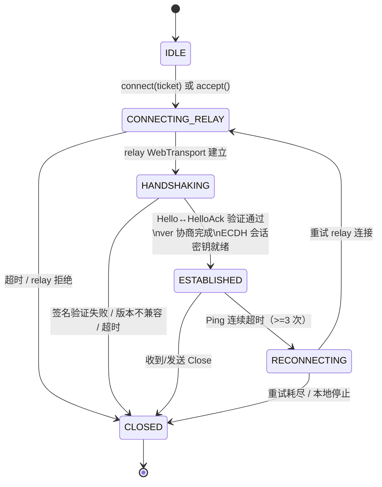
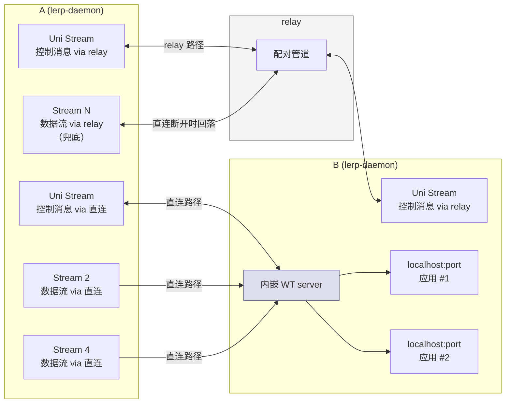
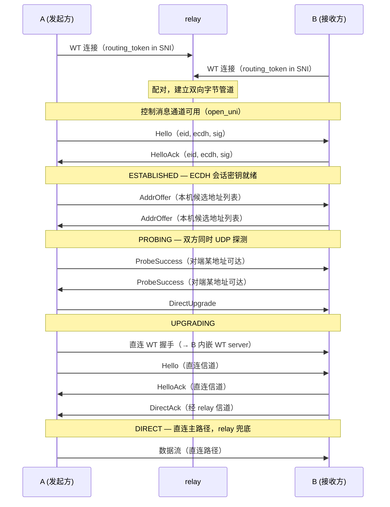
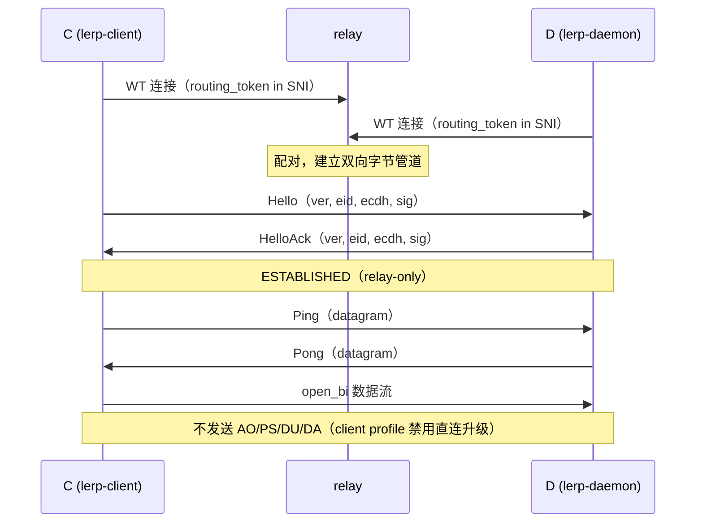
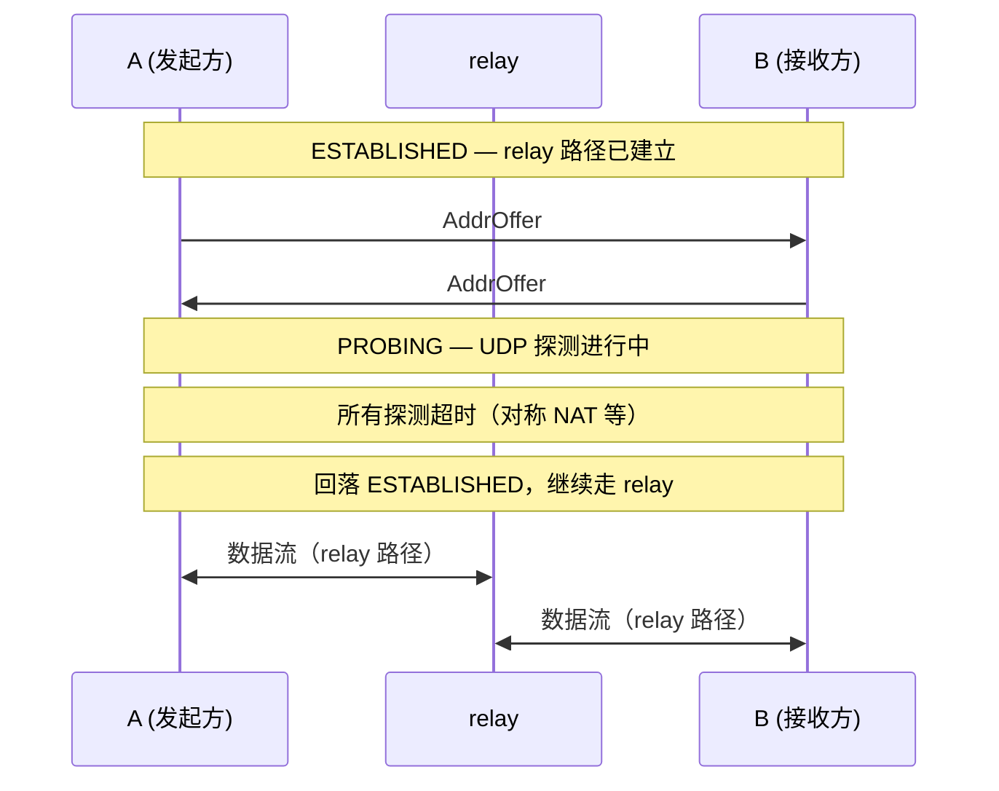

# 09 · lerp Peer Protocol (LPP)

## 概述

**LPP（lerp Peer Protocol）** 是 lerp 端点之间在 E2E 加密信道之上运行的内部控制协议。它负责：

- E2E 身份握手（Hello/HelloAck）
- 候选地址交换与打洞协调（AddrOffer / ProbeSuccess）
- 直连路径升级（DirectUpgrade / DirectAck）
- 应用数据流复用（open_bi 双向流）
- 连接保活（Ping / Pong）
- 连接关闭（Close）

LPP 运行在 QUIC 的多路复用流之上，与 relay 的 TLS 层完全独立。relay 只能看到加密后的 QUIC 字节流，无法解析 LPP 内容。

LPP 定义两个实现 profile：
- **daemon profile**：支持 relay + 直连升级（完整消息集）
- **client profile**：仅 relay 路径，不参与打洞与直连升级（消息子集）

---

## 传输层结构

LPP 充分利用 WebTransport 原生能力，无需自定义帧协议：

```
WebTransport 连接（经 relay 或直连）
  ├── Uni Stream（单向，一条 = 一条控制消息）  ← Hello / HelloAck / AddrOffer / ...
  ├── Datagram                                 ← Ping / Pong（轻量保活）
  ├── Bi Stream（双向，一条 = 一个 TCP 连接）  ← 应用数据 #1
  ├── Bi Stream                                ← 应用数据 #2
  └── ...（WebTransport 原生多路复用）
```

- **控制消息**：每条消息独占一条单向流（`open_uni()`），消息体为 msgpack，stream close = 消息结束，无需长度前缀
- **Ping / Pong**：使用 WebTransport **datagram**，无序、轻量，天然适合保活
- **数据流**：每个转发的本地 TCP 连接对应一条双向流（`open_bi()`），完全透明传输

---

## 消息类型

### Hello `"H"`

发起方 WebTransport 连接建立后，立即 `open_uni()` 发送，发起 E2E 身份握手：

```msgpack
{
  "t":    "H",
  "ver":  0,
  "eid":  "<base32 Ed25519 pubkey>",
  "ecdh": <bytes: 临时 X25519 公钥>,
  "sig":  <bytes: Ed25519 签名，签名内容为 ecdh 字段的原始字节>,
  "meta": { ... }   // 可选，ticket 中的应用自定义字段（非 lerp_ 前缀）
}
```

- `ver`：发送方支持的最高 LPP 版本号（当前为 `0`）
- `meta`：可选字段，将 ticket 中所有非 `lerp_` 前缀的应用字段原封不动转发给接收方。lerp 协议栈不解析、不校验其内容，接收方通过 `on_connect` 回调拿到。若无应用字段可省略此键。

> **安全注意**：`Hello` 在 E2E 加密（ChaCha20-Poly1305）建立**之前**发送，受底层 relay TLS 保护，但不受端到端密钥保护。因此不应在 `meta` 中放置需要端到端机密性的数据；端到端机密数据应在 `ESTABLISHED` 后通过 `open_uni` / `open_bi` 传输。

### HelloAck `"HA"`

接收方验证 Hello 后，`open_uni()` 回复，完成双向身份认证：

```msgpack
{
  "t":    "HA",
  "ver":  0,
  "eid":  "<base32 Ed25519 pubkey>",
  "ecdh": <bytes: 临时 X25519 公钥>,
  "sig":  <bytes: Ed25519 签名，签名内容为 ecdh 字段的原始字节>
}
```

- `ver`：双方协商后使用的版本号（取两者 `ver` 的较小值），后续消息均遵循此版本
- 若接收方不支持发起方的 `ver`，回复自身支持的最高版本；发起方读取 HelloAck 的 `ver` 后降级适配
- 版本不兼容（差距过大无法降级）则发送 `Close` 并断开

双方收到对方的 HelloAck 后：
1. 验证签名（Ed25519 公钥 = `eid` 字段）
2. ECDH（X25519）协商出会话密钥
3. 派生 ChaCha20-Poly1305 密钥，后续所有流数据受此密钥保护

> Hello / HelloAck 交换在 WebTransport 层（relay TLS）之上、应用层加密之下，属于 lerp 独立加密层。

---

### AddrOffer `"AO"`

E2E 握手完成后，各自 `open_uni()` 发送自己的直连候选地址列表（用于打洞）：

```msgpack
{
  "t":     "AO",
  "addrs": [
    "1.2.3.4:51820",
    "192.168.1.5:51820",
    "[2001:db8::1]:51820"
  ]
}
```

- 双方**各自发送**一条 AddrOffer，无需等待对方先发
- 地址格式：`host:port`（IPv4）或 `[ipv6]:port`
- 收到对方的 AddrOffer 后，立即开始向所有候选地址发送 UDP 探测包

---

### ProbeSuccess `"PS"`

某条 UDP 探测成功时，`open_uni()` 通知对端：

```msgpack
{
  "t":    "PS",
  "addr": "1.2.3.4:51820"   ← 对端的哪个候选地址探测成功
}
```

双方都发送 ProbeSuccess 后，发起方决定升级直连。

---

### DirectUpgrade `"DU"`

发起方 `open_uni()` 通知对端：即将发起直连 WebTransport 连接：

```msgpack
{ "t": "DU" }
```

接收方收到后，等待来自发起方的直连 WebTransport 握手。

#### 发起方判定与竞态处理

- 在双方都收到 `ProbeSuccess` 后，按 `endpoint_id` 字典序选主：**较小 `endpoint_id` 为 DU 发起方**
- 若双方因竞态同时发送 `DU`，按同样规则收敛：
  - 胜方（较小 `endpoint_id`）继续发起直连
  - 负方停止本地发起，仅进入等待直连握手
- 重复 `DU` 视为幂等消息，必须忽略副作用

---

### DirectAck `"DA"`

接收方在直连 WebTransport 连接建立且 E2E 验证通过后，通过**原 relay 连接** `open_uni()` 回复：

```msgpack
{ "t": "DA" }
```

发送后，relay 路径降为兜底，直连路径成为主路径。

---

### Ping / Pong

使用 **WebTransport datagram**（无序、无重传，轻量）：

```msgpack
{ "t": "PI", "seq": 42 }   ← Ping（datagram 发送）
{ "t": "PO", "seq": 42 }   ← Pong（datagram 发送，seq 与 Ping 相同）
```

默认策略：
- 发送间隔 30 秒
- 单次响应超时 10 秒
- **连续 >=3 次未响应且连接静默 >=90 秒** 才判定断连并进入 `RECONNECTING`
- 任意入站业务流量或控制消息可重置“静默计时”，避免移动网络抖动导致误判

---

### Close `"CL"`

`open_uni()` 主动通知对端关闭，随后关闭 WebTransport 连接：

```msgpack
{ "t": "CL", "reason": "shutdown" }
```

收到后对端关闭所有数据流并终止连接。

#### Close 竞态优先级

- `Close` 拥有最高优先级
- 一旦发送或收到 `Close`，状态立即进入 `CLOSED` 路径
- 在 `Close` 之后到达的 `AO/PS/DU/DA/PI/PO` 必须忽略（不可再触发状态迁移）

---

## 数据流协议

每个转发的本地 TCP 连接对应一条双向流（`open_bi()`），无需任何帧头，直接作为字节管道：

```
open_bi()  →  透明字节管道  →  远端 lerp-daemon  →  TCP forward  →  目标应用
```

- lerp 层不解析流内容，完全透明转发
- WebTransport stream 的 FIN 映射到 TCP 的半关闭（half-close）
- stream 由发起连接的一方（A）调用 `open_bi()` 创建

### 路径迁移语义（v0）

- `DIRECT` 建立后，仅新 `open_bi()` 走直连
- relay 路径上的在途流不迁移，按原路径自然结束
- 该规则避免迁移窗口内的数据重复、丢失和乱序

### 重连恢复语义（v0）

- `RECONNECTING` 成功后不恢复旧流，不恢复旧会话密钥
- 双方必须重新执行 `Hello/HelloAck` 与 E2E 协商
- 应用需自行重建逻辑会话

---

## 实现 Profile（daemon / client）

| 消息/能力 | daemon profile | client profile |
|---|---|---|
| Hello / HelloAck | ✅ | ✅ |
| AddrOffer | ✅ | ❌ |
| ProbeSuccess | ✅ | ❌ |
| DirectUpgrade / DirectAck | ✅ | ❌ |
| Ping / Pong（datagram） | ✅ | ✅ |
| Close | ✅ | ✅ |
| open_bi 数据流 | ✅ | ✅ |
| P2P 打洞与直连升级 | ✅ | ❌（固定 relay） |

规则：
- daemon ↔ daemon：可进入 `PROBING / UPGRADING / DIRECT`
- client ↔ daemon、client ↔ client：固定 relay，仅停留在 `ESTABLISHED`
- 收到超出本 profile 的消息（例如 client 收到 `DU`）应返回 `Close(reason="unsupported_message")`

---

## 完整状态机

### daemon profile（支持直连升级）



### client profile（relay-only）



---

## 双路径并存示意（仅 daemon ↔ daemon）



---

## 消息时序

### 正常连接（直连升级成功）



### client ↔ daemon（relay-only）



### 打洞失败（保持 relay）




